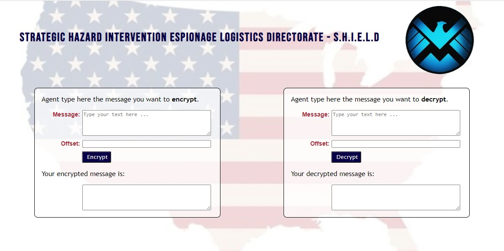
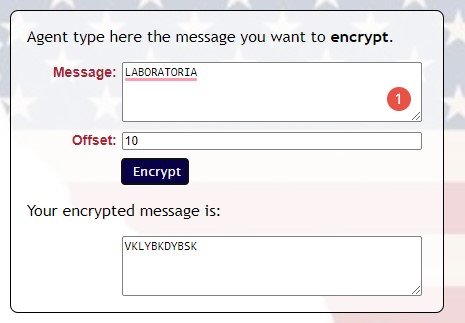
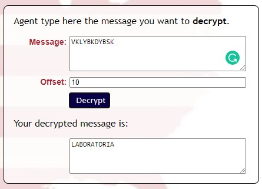

# Cifra de César - SHIELD

Projeto desenvolvido para codificação e decodificação de mensagens.

## Índice

* [1. Introdução](#1-introdução)
* [2. Aplicação](#2-aplicação)
* [3. Funcionalidades e Utilização da Página](#3-funcionalidades-e-utilização-da-página)
  * [O que é Cifra de César?](#o-que-é-cifra-de-césar?)
  * [Conhecendo o site](#conhecendo-o-site)
  * [Criptografando uma mensagem](#criptografando-uma-mensagem)
* [4. Colocando a mão na massa](#4-colocando-a-mão-na-massa)
* [5. Processo e decisões](#5-processo-e-decisões)

## 1. Introdução

Desenvolvido com intuito de aprendizagem e como primeiro projeto do Bootcamp da Laboratória, tem como objetivo a codificação e decodificação de mensagem, utilizando como base para isso a Cifra de Cesar - que consiste no deslocamento do alfabeto para a codificação dele. Neste projeto o deslocamento fica a cargo de quem utilizará a ferramenta, veremos mais sobre isso nos próximos tópicos. 

## 2. Aplicação

Desenvolvido especialmente para os agentes e funcionários da SHIELD, o projeto visa a codificação de mensagens entre seus colaboradores.

*Vocês devem estar fazendo a mesma pergunta que eu, eles são super Heróis, por que um site para codificar mensagens?*
A SHIELD é composta por agente de campo e agente internos, e muitos deles trabalham analisando coordenadas, pessoas, dados e lugares (o que a Marvel não mostra). Com isso a troca de mensagens entre agentes (internos e de campo) precisa ser homogênea, sendo assim necessário um meio de fazer isso sem o medo da mesma ser interceptada.

O projeto visa especialmente manter seguro a troca de mensagens com total descrição, onde mesmo se ela for interceptada não será possível a decodificação sem os parâmetros corretos.

**Sempre cuidando dos interesses dos EUA e do Mundo!**

## 3. Funcionalidades e Utilização da Página

Vamos voltar um pouco o assunto para assim melhorarmos a sua experiência com o projeto.

### *O que é Cifra de César?*

Nomeada em homenagem ao Imperador **Júlio César**, esse estilo de criptografia é o mais antigo que se tem registro, e ficou conhecido ao ser utilizado pelo imperador para criptografia de mensagens aos seus soldados.
Ela é uma das mais simples e conhecidas técnicas de criptografia e consiste em substituir uma letra por outra um número fixo de vezes.

### *Conhecendo o site*

Para este projeto foi criado um site onde os usuários inserem as informações solicitadas para criptografar e descriptografar as mensagens.

### *Criptografando uma mensagem*

Como vimos já a cara do projeto acima, para criptografar a mensagem solicitada você deve escolher o box do **Encrypt**, e seguir as informações solicitadas, informando a mensagem que você deseja criptografar e o quando de deslocamento você deseja que o sistema calcule e criptografe sua mensagem.

Conforme a imagem acima podemos verificar a criptografia da palavra **LABORATORIA** com um deslocamento de alfabeto em 10 casas. Trazendo a mensagem: *VKLYBKDYBSK*

Para a descriptografia basta você utilizar o box que está escrito o **Decrypt** com o deslocamento informado pela pessoa que criptografou a mensagem.

* Lembrando que a pessoa que lhe mandar a mensagem criptografada, precisa lhe informar o deslocamento (offset) em que ela criptografou a mesma caso contrário você terá que fazer várias tentativas para acertar.

## 4. Colocando a mão na massa

Gostaram do projeto, então o que está esperando para testar? Não sabe como ainda? Não se preocupe, estou aqui para lhe ajudar.

Você pode simplesmente clicar [aqui](https://kauanaagostini.github.io/SAP005-cipher/) e será direcionado a página.

Ou se preferir você pode baixar o projeto em seu computador.

Para rodar o projeto você precisará ter instalado em seu computador *Git* e *Node.js*.
Após instalar as ferramentas acima você através do seu terminal, fará o **clone** do projeto e instalará todas as dependências.

Finalizando esse processo, você dará o comando no terminal "npm start" e em seguida já poderá acessá-lo através do diretório local.

## 5. Processo e decisões

A ideia do tema surgiu quando ao pensar em criptografia de mensagem logo lembrei do filme Missão Impossível, onde no início (de um dos filmes) o agente secreto Ethan Hunt recebe uma mensagem em um óculos de sol e após ouvir toda a mensagem o mesmo explode.

Então fui pensando em várias organizações no ramo cinematográfico que poderia utilizar a ferramenta chegando então na SHIELD.

Até então eu estava apenas com a lógica desenvolvida e a partir disso comecei a desenvolver o HTML e o CSS, onde quis trazer o lado patriota dos norte-americanos, trazendo a bandeira norte-americana de fundo da página, juntando com todos os textos estarem nas cores azul e vermelho no mesmo tom da bandeira.

Além disso quis trazer um site mais limpo e objetivo, para que a experiência do usuário seja a melhor possível.